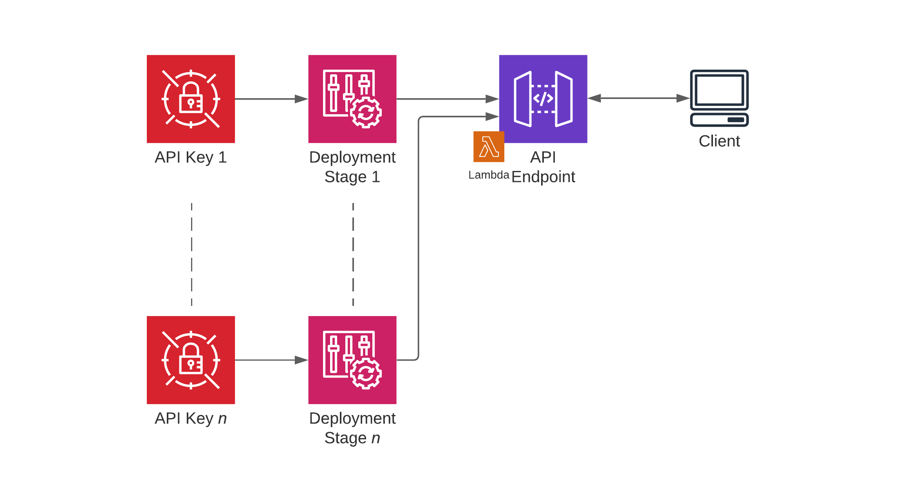
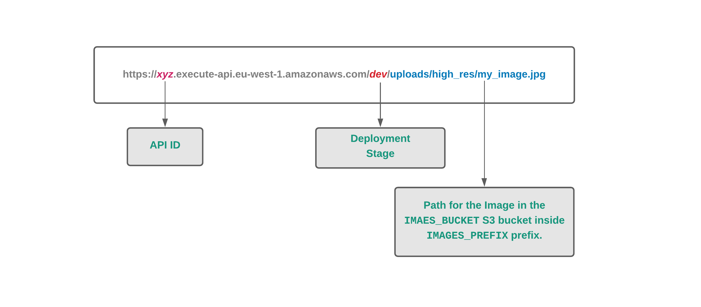
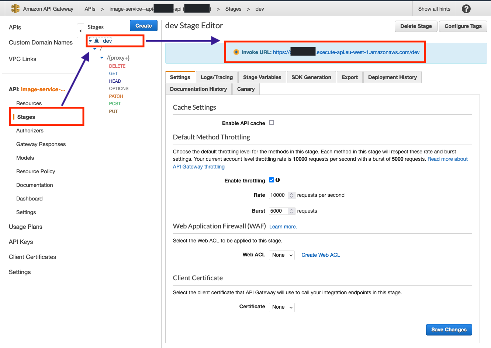
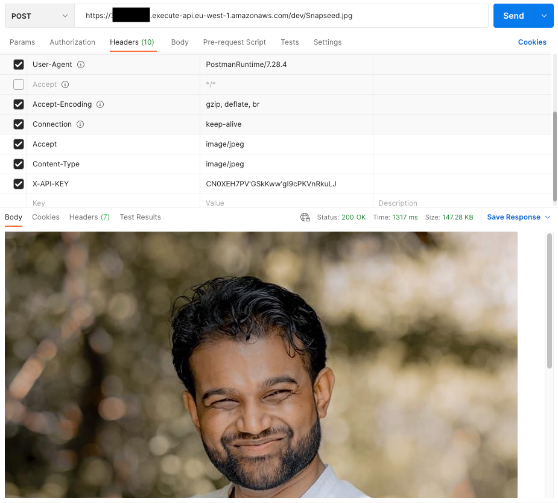

# AWS S3 Image Service
Simple, yet scalable API to deliver images from an AWS S3 bucket.

This uses AWS APIGateway backed by a Lambda function as a Proxy Resource that talks directly to our S3 bucket with images.
A complete explanation of the process can be found in 
[this article](https://gnomezgrave.com/2021/06/03/image-service-using-aws-api-gateway-with-proxy-resources/).
However, there are some differences and optimizations I made compared to what's already explained in the article, 
especially related to [uploading the PIL libraries](https://gnomezgrave.com/2021/07/03/add-resizing-to-the-image-service-with-pil/).



## How does it work?

Since I already explained the high-level architecture in 
[my blog post](https://gnomezgrave.com/2021/06/03/image-service-using-aws-api-gateway-with-proxy-resources/), 
I will explain here how the Lambda function works.

The URL to retrieve an image would look something like this.



The images are expected to stored inside the S3 bucket defined by `IMAGES_BUCKET` with the `IMAGES_PREFIX` root prefix.
According to this example, and the default values, the image is stored in the following path.

```
s3://image-service--api--frodo-images-bucket/original-images/uploads/high_res/my_image.jpg
```

We have to make sure these images are available in the given path, otherwise the API will return a `404`.
We can change the root prefix for the original images with the `OriginalImagesPrefix` in the Cloudformation template. 

## Build and deploy

### Prerequisites

* Docker installed and running
* Common build tools (including `make`) installed
* `aws cli` installed and configured with your AWS account
* Python3 installed

### Build

We use a `Makefile` to build and deploy the code, and there are several recipes for different stages. 
We can also change the variables defined in the `Makefile` to change our deployment.  

#### Initialize the environment

1. `make init`  
    This command will create an S3 bucket to hold the deployments, and then create a Python virtual environment in your project folder.
2. `source .venv/bin/activate`  
    This activates the virtual environment for us to install the dependencies.
   
#### Build Lambda container

We can't simply upload the local build package to cloud since this uses PIL (Python Imaging Library) that has pre-compiled libraries.
If we simply upload the local `_build` folder in the traditional way, these libraries won't work on the AWS Lambda environment.
So, we should get the binaries which are compatible with AWS Lambda. For this purpose, we're creating a temporary Docker container
with AWS Lambda Docker image, download the dependencies for that environment, then copy them to our `_build` folder.

These steps are automated in the `get_dependencies.sh` script, and can be triggered with the `get-dependencies` make recipe.

```shell
make get-dependencies
```

Whenever we make a code change, we should sync these changes to `_build` folder, and we can do it with the below recipe.

```shell
make sync
```

### Deploying

There are two main recipes for the Cloudformation deployment.

1. `make package`  
    This creates a package with the pre-compiled Cloudformation template and the code.
2. `make deploy`  
    This deploys the Cloudformation template to AWS.
   
**NOTE**: We need to run `make get-dependencies` for the first time, and also whenever we change the `requirements.txt` file.

We can also run all these steps in a single make recipe as below.

```shell
make release
```

### Destroy

Whenever you need to delete the stack, you can run the below command.

```shell
make _delete
```

**CAUTION**: This will delete everything inside the S3 buckets defined in the Cloudformation stack.

## Using the API

After the deployment, we need to extract the endpoint for our stage (`dev` by default), and then the API Key to call it.

1. Navigate to the Cloudformation stack, and click on Resources tab.
2. Look for your RestAPI and click on the link.
3. Click on the Stages from the left pane, and select the stage (i.e. `dev`) you deployed.
4. Copy the endpoint URL it shows on top.



Now we need to extract the API Key for our stage.

1. Click on the ApiKey (`AWS::ApiGateway::ApiKey`) from the Cloudformation stack.
2. Click on the "Show" button in front of the "API Key" field.
3. Copy the API key (without any spaces around it).

Now we can use any tool which can call an API (i.e. Postman, curl, etc.)

We have to set `X-API-KEY` value to the API Key we copied above. Then we also should set `Accept` and `Content-Type` parameters 
to `image/jpeg` (to match the content type we defined in the RestAPI).

### Using Postman


### In Python3

```python
import requests

headers = {
    'Content-Type': 'image/jpeg',
    'Accept': 'image/jpeg',
    'X-API-KEY': 'you_api_key'
}

stage = "dev"

image_path = 'Snapseed.jpg'
# generate a file name with the last part of the URL 
# (only the xyz.jpg part).
file_name = image_path.split('/')[-1]
url = f" https://my_api.execute-api.eu-west-1.amazonaws.com/{stage}/{image_path}"

response = requests.get(url, headers=headers)

if response.status_code == 200:
    print('Success!')
    image = response.content  # base64 encoded image content
    
    # Download the image (optional)
    with open(file_name, 'wb') as img:
        img.write(image)
    
elif response.status_code == 404:
    print('Not Found.')
```

## TODO

We still need to add more features to this Image Service.

### Tests

We still don't have tests for this codebase.

### Resizing
We should add transformation parameters (such as resizing and rotation) to the URL. 
Then these resized images should be stored inside a separate prefix (i.e. `/resized/`) in the same level as the `/original-images/`.

### Support multiple API Keys

In order to track usages of different users, we can have different stages deployed. 
We need to have several API usages plans with different API Keys to achieve this.

## Contributing

If you found any bugs, potential improvements, or even new features, feel free to do the changes and make a Pull Request.